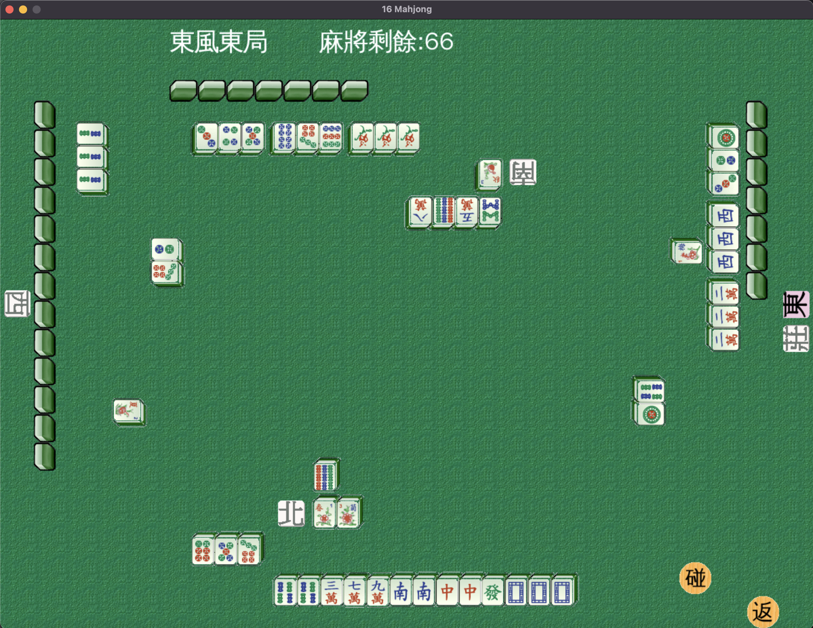
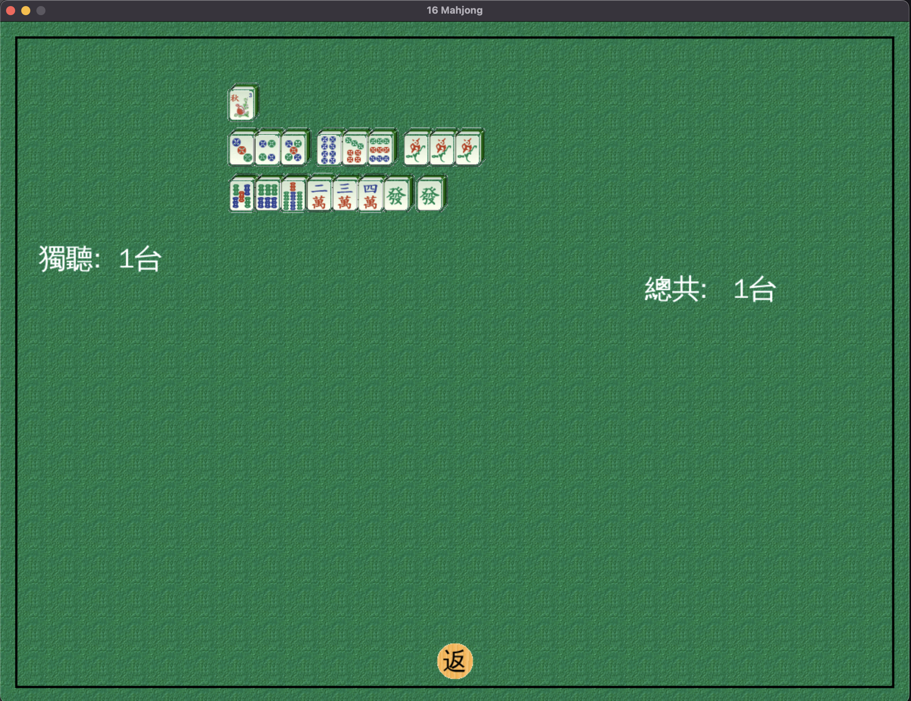

# 16MJ

一款使用 Python 撰寫的麻將遊戲。




## 安裝

```bash
python3 -m venv .python
source .python/bin/activate
(.python) pip3 install -r requirements.txt
(.python) python3 p16mj.py
```

## 遊戲說明

大部份採用台灣16張麻將的規則，一開始隨機選出一家做東家，
由東家開始做莊，電腦會避免吃6萬打6萬，
或者手牌有5, 6萬吃7萬，打4萬之類的，
但是人類玩家仍然可以這樣吃。

* 當"碰"發生時，玩家可以按"碰"的按鈕，會自動處理碰。
* 當"吃"發生時，玩家可以按"吃"的按鈕，按鈕會變紅字，
此時用滑鼠鍵選兩張手牌，如果可以吃，會自動處理。
(即使只有一組可吃，也需要玩家選牌)
* 當"吃"和"碰"(槓))都發生時，會先顯示碰(槓)，
玩家如要執行"吃"，需先按"返"，才會出現"吃"的按鈕。
* 當"碰槓"發生時，玩家可以按"槓"的按鈕，會自動處理碰槓。
* 當"暗槓"發生時，玩家可以按"槓"的按鈕，按鈕會變紅字，
此時用滑鼠選手牌，當手牌有四張一樣，或有三張手牌一樣，
且摸到的牌也跟這三張一樣，會自動處理暗槓。
(即使只有一組可暗槓，也需要玩家選牌)
* 當"加槓"發生時，玩家可以按"槓"的按鈕，按鈕會變紅字，
此時用滑鼠選碰牌，當玩家手牌或摸到的牌中有跟碰牌一樣的，
會自動處理加槓。
(即使只有一組可加槓，也需要玩家選牌)
* 當"聽"發生時，玩家可以按"聽"的按鈕，聽的按鈕會變紅字，
且會自動進入聽的模式。在聽的模式下，如果可以暗槓，
且暗槓之後仍然聽牌，會自動暗槓。否則不能胡牌的話，
會自動丟牌。另外聽牌在台灣麻將規則中，不一定要說，
通常是不說，所以電腦不會告知自己聽牌，除非是天聽或地聽。
* 當"胡"牌發生時，可以按"胡"的按鈕，宣告自己胡牌。
* 當按下"返"的按鈕時，如果有聽以外的按鈕是紅字，
會將按鈕回復到不是紅字。否則，會放棄吃，碰，槓或胡牌。
* 除了聽的紅字按鈕以外，當按下按鈕變紅字時，再按一次該按鈕，
可以回復成黑字的狀態。

## 網頁版

使用瀏覽器即可遊玩簡易的網頁版。
開啟 `web/index.html` 即可開始。網頁版提供四人對戰，您可點擊手牌丟牌，
電腦玩家會依序抽牌並隨機打出一張牌。除自摸外，現在也支援吃、碰、槓
與胡牌的判定，玩家可在其他人打出的牌上進行對應操作。吃或碰後系統
會立即補抓一張牌，且玩家與電腦的手牌皆會自動排序。
網頁版同樣遵循上述規則，右下角另有按鈕可切換是否顯示電腦玩家的手牌。

## 參考來源

- https://gitlab.com/movep/16mj
- https://github.com/simonchih/16mj
- Mahjong wiki(https://en.wikipedia.org/wiki/Mahjong)
- TJMJ(https://sourceforge.net/projects/tjmj/)
- http://163.20.160.14/~word/modules/myalbum_search/
